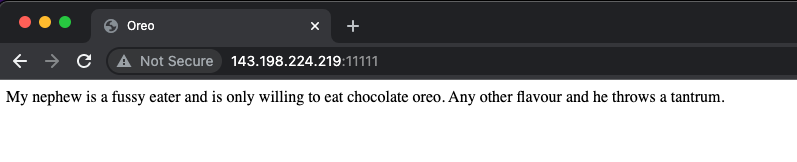
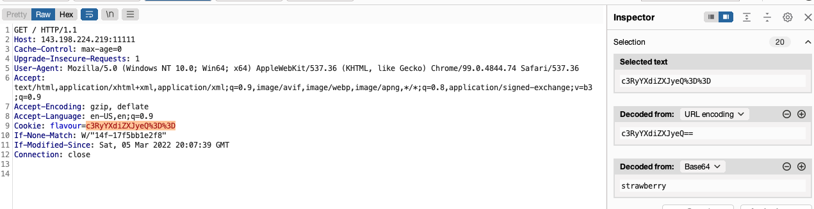
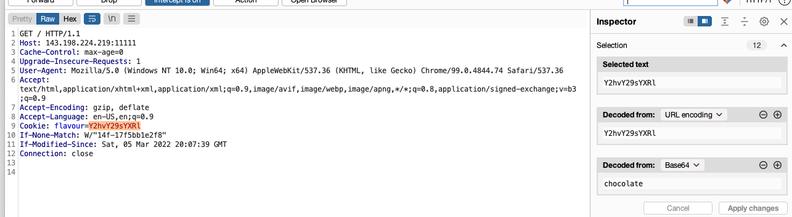
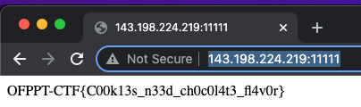

## Chocolate
##### 400
### Challange

My friend is only willing to eat chocolate. Any other food he rejects.

#### Link
http://143.198.224.219:11111/

---
### Description

This Challange is Web Challange.

The hint is the Challage Name.


First the Connect to the site, You can see Just Only this.

```My nephew is a fussy eater and is only willing to eat chocolate oreo. Any other flavour and he throws a tantrum.```



But when you connected into the website, the cookie automatically saved into your local, after reconnect to the website with burpsuite, You can find the cookie value. 



You can see the 
``` Cookie: flavour = c3RyYXdiZXJyeQ%3D%3D```
It's encoded with base64, so the burpsuite can decode base64, after that you can change the cookie on burp suite. So change Cookie value to 
``` flavour=(base64encoded chocolate)```



then you can get the flag.



## Flag
The flag is ```OFPPT-CTF{C00k13s_n33d_ch0c0l4t3_fl4v0r}```