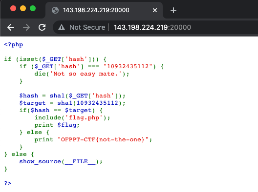
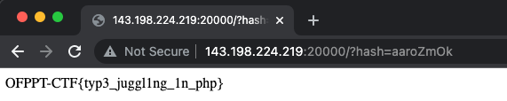

## php
##### 481
### Challage
This website is broken; it shows its php source code. Can you find a way to read the flag.
No scanners needed for this challenge!

#### Link
http://143.198.224.219:20000

---
### Description

This Challange also Web Challlage/

You can see the source code of website when you connect to the web site.

```<?php

if (isset($_GET['hash'])) {
    if ($_GET['hash'] === "10932435112") {
        die('Not so easy mate.');
    }

    $hash = sha1($_GET['hash']);
    $target = sha1(10932435112);
    if($hash == $target) {
        include('flag.php');
        print $flag;
    } else {
        print "OFPPT-CTF{not-the-one}";
    }
} else {
    show_source(__FILE__);
}

?>

```


You can find the hash must be ```10932435112``` to get flag.

But as you can see part of source code,
```
if ($_GET['hash'] === "10932435112") {
        die('Not so easy mate.');
    }
    ```
It can't use the string.

This problem is using sha-1 hash.
So you can find the **magichash**.

find the magichash on here

https://github.com/spaze/hashes/blob/master/sha1.md

there is a lot's of magic hash in here. so you can using one of hash from the list.

So i trying to use ``` aaroZmOk ```

This thing can bypass the HASH.

And the method is get, so you need to add 

``` ?hash="magichash" ```

Behind of the website address.

``` ?hash=aaroZmOk ```

Then you will get the Flag!



### Flag

```OFPPT-CTF{typ3_juggl1ng_1n_php}```


